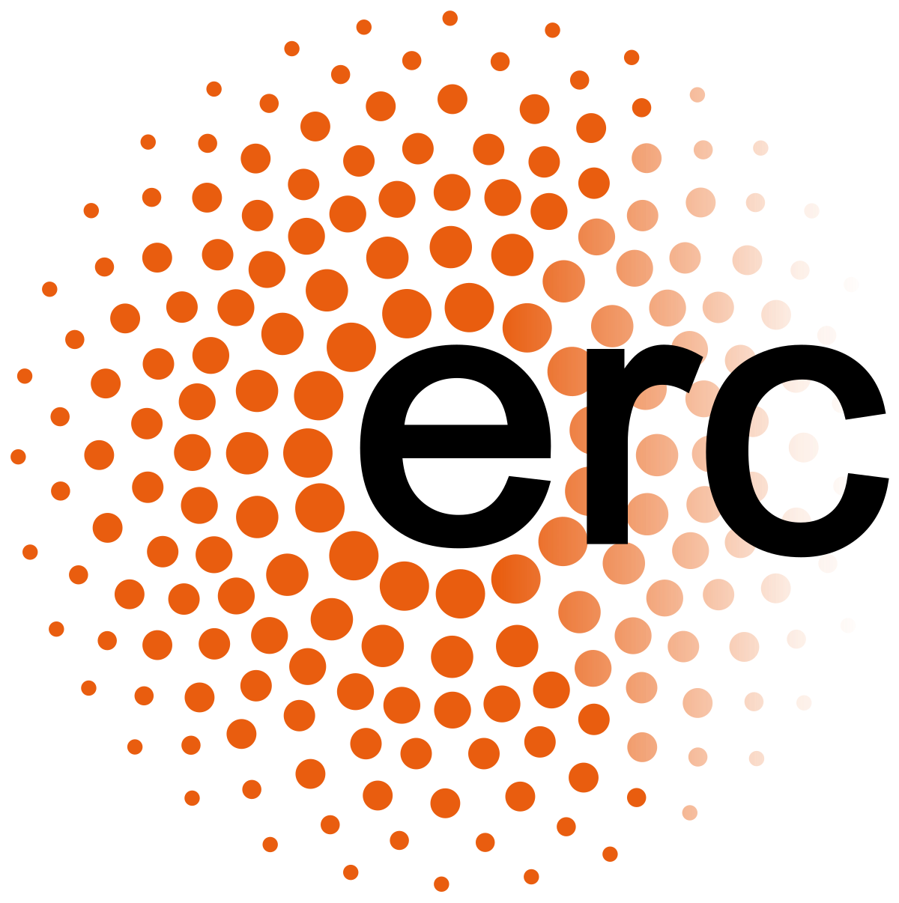

<p align="center">
  
</p>

<p align="center">
  <b>Funded by the ERC project URANUS:</b><br>
  <i>Real-Time Urban Mobility Management via Intelligent UAV-based Sensing</i>
</p>

<p align="center">
  <a href="https://github.com/TsioutisCh/SUMO-UAV-Py/actions/workflows/ci.yml"></a>
  <a href="LICENSE"></a>
  
  <a href="https://github.com/TsioutisCh/SUMO-UAV-Py/commits/main"></a>
  <a href="https://github.com/TsioutisCh/SUMO-UAV-Py/issues"></a>
</p>

# SUMO-UAV-Py

**SUMO-UAV-Py** is a plugin for simulating drone-based traffic sensing within the [SUMO](https://www.eclipse.dev/sumo/) (Simulation of Urban MObility) microscopic traffic simulator. It enables the generation of high-resolution aerial observations by integrating Unmanned Aerial Vehicle (UAV) dynamics, camera field-of-view modeling, and configurable flight paths into standard SUMO simulations. This tool is ideal for researchers working on UAV-based traffic state estimation, surveillance strategies, and aerial sensing validation under realistic traffic conditions.

## 🚀 Features

- Real-time UAV sensing in SUMO with no post-processing required
- Multiple UAV flight behaviors: `Hovering`, `Sampling`, `Spinning`
- 3D trajectory simulation using 5D waypoints (time, x, y, z, yaw)
- Manual or script-based UAV paths
- Battery constraints (optional)
- GUI-based or JSON-based configuration
- Modular architecture for integration with external planners

## 🛠 Requirements

- Python 3.7+
- SUMO (Eclipse version) with `SUMO_HOME` set — see the [SUMO installation guide](https://sumo.dlr.de/docs/Installing/index.html)
- Python dependencies listed in `requirements.txt`

Install dependencies with:
```bash
pip install -r requirements.txt
```

`traci` must match your installed SUMO version — see the comment in `requirements.txt` if `pip install` pulls in an incompatible one.

## ⚙️ Configuration

You can run the plugin in two ways:

- **With GUI** via `uavpy_gui.py` (or the launcher: `uav_gui_run.bat`)
- **Without GUI** using a config file directly (`uav_run.bat` or `main.py`)

### Example `config.json`

```json
{
    "Movement": "Continuous",
    "Remote Server": false,
    "Local GUI": false,
    "Uav Model": "Mavic 2e",
    "Battery Mode": true,
    "Battery life (s)": 420,
    "GUI Option": true,
    "Uav Mode": "Hovering",
    "Network file": "BolognaScenario/acosta_buslanes.net.xml",
    "Sumocfg file": "BolognaScenario/run.sumocfg",
    "Step length (s)": 1,
    "Total time (s)": 1000,
    "Delay": 0,
    "Number of UAVs": 1,
    "uav_data": {
        "0": [
            [0, 1025, 1589, 0, 0],
            [10, 1150, 1385, 300, 0],
            [100, 1150, 1585, 300, 0],
            [200, 750, 1585, 300, 0],
            [1080, 1025, 1589, 0, 0]
        ]
    }
}
```

Each UAV is defined by time-indexed 5D waypoints: `[time, x, y, z, yaw_angle]`.

`Uav Model` selects the flight envelope: `"Mavic 2e"` and `"Mini 3 pro"` use built-in FOV/speed presets. Set it to `"Manual"` to supply your own `FOV (deg)`, `UAV Speed`, and `Yaw Speed` fields instead — see `config.json` in this repo for a fully worked example with multiple UAVs.

## 📁 Directory Structure

```
SUMO-UAV-Py/
├── config.json               # Simulation configuration
├── main.py                   # Headless/GUI-overlay simulation runner
├── main_test.py               # Post-processing benchmark runner (works from a SUMO fcd-output file)
├── uavpy_gui.py               # Tkinter GUI for editing config.json and launching main.py
├── client.py                  # Example TCP client for "Remote Server" mode
├── uav_gui_run.bat            # Windows launcher for uavpy_gui.py
├── uav_run.bat                # Windows launcher for main.py
├── utils.py                   # UAV kinematics, FOV geometry and TraCI polygon/POI helpers
├── requirements.txt
│
├── BolognaScenario/            # Example SUMO scenario (network, routes, sumocfg)
├── NetworkNicosia/             # Example SUMO scenario (network, routes, sumocfg)
│
├── Outputs/
│   └── uav_output.csv        # Real-time UAV + observed-vehicle log (generated on each run)
│
├── images/
│   ├── manual.png / manualLQ.png
│   ├── mini3pro.png / mini3proLQ.png
│   ├── mavic2e.png / mavic2eLQ.png
│   └── kiosLogo.ico / kiosLogo.png
│
└── README.md
```

To use your own SUMO network, point `Network file` and `Sumocfg file` in `config.json` at your own `.net.xml`/`.sumocfg` — they don't need to live in a specific folder.

## ▶️ Usage

1. Ensure SUMO is installed and `SUMO_HOME` is properly set.
2. Modify `config.json` to define UAV and simulation parameters.
3. Launch the simulation:

**Using the GUI:**
```bash
python uavpy_gui.py
```

**Without GUI:**
```bash
python main.py
```

Windows users can instead double-click `uav_gui_run.bat` / `uav_run.bat`.

## 📌 Notes

- The plugin supports both **continuous motion** (rotate → move → rotate) and **discrete scripted motion**.
- The FoV is rectangular and rotates with UAV yaw. Width and height scale with altitude.
- Observations are stored in `Outputs/uav_output.csv` and include vehicle IDs, positions, speeds, and UAV metadata.
- If `Battery Mode` is enabled, UAVs will stop sensing once their battery life (in seconds) is exceeded.

## 🧠 Use Cases

- Microscopic UAV-based traffic sensing
- Validation of drone trajectory planners
- Scenario testing for emergency response using drones
- Synthetic drone data generation for ML training

## 📢 Acknowledgements

<p align="center">
  
  &nbsp;&nbsp;&nbsp;
  
</p>

This work was supported by the **European Research Council (ERC)** under the **European Union's Horizon 2020 research and innovation programme** (Grant agreement No. 101043968 – URANUS).

We gratefully acknowledge the URANUS project for its support in developing this plugin as part of a broader investigation into next-generation urban traffic monitoring systems using aerial sensing.

## 📄 License

Distributed under the [MIT License](LICENSE).

## 🤝 Contributing

Contributions are welcome — see [CONTRIBUTING.md](CONTRIBUTING.md) for how to set up a dev environment and submit changes.

## 📫 Contact

For issues, questions, or feature requests, feel free to contact:

tsioutis.charalambos@ucy.ac.cy

## 📚 References

If you use this plugin in your research, please cite:

> Tsioutis, C., Makridis, C., & Timotheou, S. (2025). **SUAVPy: A SUMO Plugin for UAV-Based Ground Traffic Sensing**. *SUMO Conference Proceedings*, 6, 65–77. https://doi.org/10.52825/scp.v6i.2610

> Bieker, L., Erdmann, J., & Krajzewicz, D. (2014). **Traffic Simulation with SUMO – Simulation of Urban MObility**. *SUMO User Conference 2014*.
